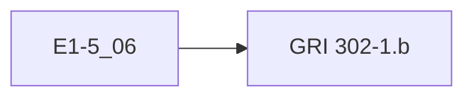
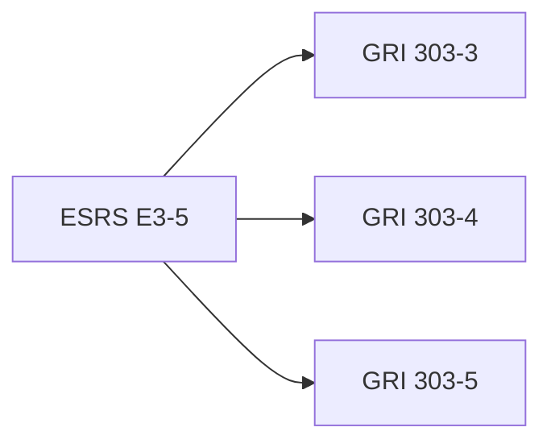
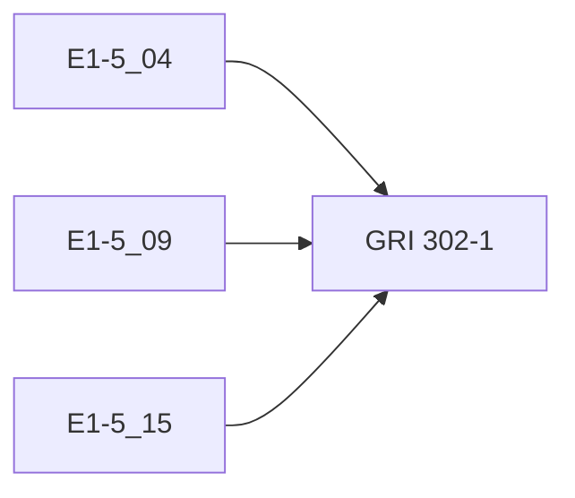
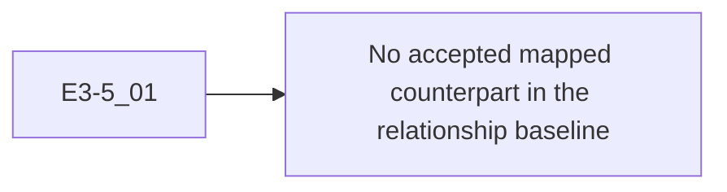
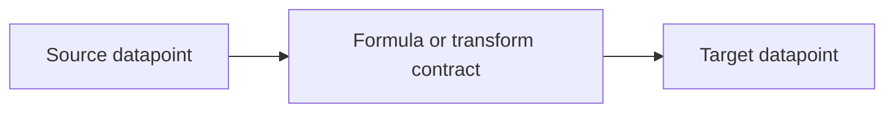

# E2 - Interoperability across Standards (ESRS-GRI-GHG-SDS)

Project: Sustainability Data Spaces (SDS)
Deliverable: E2 - Interoperability Report
Version: V2026-06-08
Date: 2026-06-08
Owner: SDS Program Office

## Summary

E2 defines the SDS interoperability layer for mapping commonalities, differences, and governed relationships between sustainability reporting standards. It satisfies the project acceptance requirements for cross-standard mapping and technical recommendations, and it defines the active SDS relationship model for ESRS, GRI, and GHG Protocol anchors. [@EU_CSRD_2022_2464] [@EU_ESRS_2023_2772] [@GRI_STANDARDS_2025] [@GHG_PROTOCOL_CORPORATE_STANDARD] [@GHG_PROTOCOL_SCOPE3_STANDARD]

E2 is distinct from E1. E1 measures official-standard coverage; E2 measures reviewed relationship coverage between standards. Full coverage of ESRS, GRI, and GHG Protocol in E1 does not automatically mean full interoperability in E2. E2 only counts relationships that have been reviewed, typed, and evidenced.

## Public Evidence

The public E2 evidence surface is:

- External public standards: CSRD/ESRS, GRI Standards, and GHG Protocol corporate and value-chain standards. [@EU_CSRD_2022_2464] [@EU_ESRS_2023_2772] [@GRI_STANDARDS_2025] [@GHG_PROTOCOL_CORPORATE_STANDARD] [@GHG_PROTOCOL_SCOPE3_STANDARD]
- Project deliverable evidence: the E02 public artifact and the E02 row in `deliverables/deliverables-register.csv`, which records the canonical path, version, checksum, privacy class, and sanitized source reference.
- Cross-deliverable context: the E01 public artifact records the official-standard baseline that distinguishes standard coverage from reviewed interoperability.

Internal verification snapshots and quality gates remain part of the engineering evidence trail. They are not enumerated here as public deliverable evidence.

## Project Acceptance Criteria

| Requirement | Public acceptance shape |
|---|---|
| `R3` Complete cross-standard mapping | The report maps at least `75%` of identified key interoperability points between the selected standards and presents the results in tables or diagrams. |
| `R4` Technical recommendations | The report provides clear, actionable technical recommendations to transform and align data between standards. |
| Topic detection | The accepted topic metric set keeps at least one framework reference for at least `90%` of reviewed rows. |
| No forced equivalence | Non-equivalent and missing relationships remain explicit so public interoperability claims are not overstated. |

## Accepted Topic Metrics

| Topic | Coverage | Detection | Coverage gate | Detection gate |
|---|---:|---:|---|---|
| Energy | `80 / 85` (94%) | `85 / 85` (100%) | PASS | PASS |
| GHG | `146 / 154` (95%) | `154 / 154` (100%) | PASS | PASS |
| Water | `43 / 53` (81%) | `53 / 53` (100%) | PASS | PASS |

These metrics satisfy the `>=75%` relationship-coverage gate and the `>=90%` detection gate for the Energy, GHG, and Water topic set across the selected ESRS and GRI scope. [@EU_ESRS_2023_2772] [@GRI_STANDARDS_2025]

## Relationship Baseline Model

E2 reporting uses reviewed relationship records, not raw indicator counts. The relationship baseline has these required fields:

| Field | Meaning |
|---|---|
| Source standard and official ID | ESRS, GRI, or GHG Protocol source anchor from the official baseline |
| Target standard and official ID | Target official anchor being compared |
| Relationship type | `equivalent`, `broader`, `narrower`, `component`, `transform`, `support_context`, `no_match`, or `pending_review` |
| Coverage status | `accepted`, `rejected`, `pending_missing_standard`, `pending_evidence`, or `pending_review` |
| Evidence | Source evidence, technical validation, or controlled review note |
| Activation status | report-only, preview, imported, materialized, or retired |

E2 KPIs are therefore:

| KPI | Definition |
|---|---|
| Candidate review coverage | Reviewed relationship candidates / candidate relationship universe |
| Accepted relationship count | Accepted mappings by relationship type |
| Exact equivalence count | Strict `equivalent` relationships only |
| Transform/component coverage | Relationships that require formulas, components, denominators, or support rules |
| Explicit no-match count | Reviewed non-mappings retained to prevent false equivalence |
| Pending count | Candidates blocked by missing evidence, missing standard, or pending review |

The official baselines establish ESRS, GRI, and GHG Protocol as available anchors for relationship review, but they do not by themselves create accepted cross-standard relationships. [@EU_ESRS_2023_2772] [@GRI_STANDARDS_2025] [@GHG_PROTOCOL_CORPORATE_STANDARD] [@GHG_PROTOCOL_SCOPE3_STANDARD]

## Interoperability Capabilities

E2 provides these governed SDS interoperability capabilities:

- reviewed relationship publication between standards;
- validation that each relationship refers to standards available in the target SDS environment;
- controlled review before relationships become active in mapping, calculation, search, or export behavior;
- relationship taxonomy for `equivalent`, `broader`, `narrower`, `component`, `transform`, `support_context`, `no_match`, and pending statuses;
- no-false-equivalence handling through explicit non-matches and non-equivalent relationship types;
- GHG Protocol exact-equivalence anchors for selected Scope 1 and Scope 2 relationships; and
- unit-aware and calculation-aware transformation support for relationships that are not strict equivalences.

## Published Crosswalk Layers

| Public layer | Role |
|---|---|
| ESRS-GRI topic correspondence | Accepted topic-classified relationship evidence for the Energy, GHG, and Water scope |
| Granulated modelling layer | Relationship-level evidence with unit, dimension, and downstream modelling hints |
| Completeness baseline | Accepted completeness evidence for the E2 coverage gate |
| Detection baseline | Accepted detection evidence for the E2 detection gate |
| GHG Protocol exact-equivalence layer | Additional evidence for reviewed Scope 1 and Scope 2 exact-equivalence anchors |

## Mapping Examples

E2 is about **traceable correspondence**, not forced equivalence. These page-friendly examples capture the relationship patterns that SDS supports.

### 1-to-1 Example

`E1-5_06` maps cleanly to `GRI 302-1.b`.

### 1-to-n Example

`ESRS E3-5` maps to multiple GRI disclosure anchors in the accepted water topic baseline.

### n-to-1 Example

Several ESRS energy datapoints reuse the same GRI anchor `GRI 302-1`.

### 1-to-none Example

Gap cases remain explicit rather than being forced into false mappings. Example: `E3-5_01`.

### Transform Example

Some relationships are not equivalences. They require formulas, denominator policy, unit policy, or component logic before they can be used operationally.

## GHG Protocol Exact-Equivalence Layer

E2 includes a controlled GHG Protocol exact-equivalence layer for reviewed Scope 1 and Scope 2 correspondences. [@GHG_PROTOCOL_CORPORATE_STANDARD] [@GHG_PROTOCOL_SCOPE3_STANDARD]

This layer records reviewed exact correspondences for:

- Scope 1 total GHG emissions.
- Scope 2 location-based GHG emissions.
- Scope 2 market-based GHG emissions.

Scope 3 and non-equivalent candidates are deliberately excluded from strict equivalence claims because those relationships require broader judgement and should not be presented as direct equivalences.

## Additional Technical Scope

The minimum E2 project requirement is an ESRS/GRI interoperability report with at least `75%` coverage over identified key interoperability points plus technical recommendations. E2 covers that requirement and documents the following additional technical scope:

| Additional scope item | Relationship to the minimum project requirement |
|---|---|
| GHG Protocol added to interoperability scope | The minimum E2 requirement names CSRD/ESRS and GRI. GHG Protocol exact-equivalence evidence and GHG baselines add framework coverage. [@EU_CSRD_2022_2464] [@EU_ESRS_2023_2772] [@GRI_STANDARDS_2025] [@GHG_PROTOCOL_CORPORATE_STANDARD] [@GHG_PROTOCOL_SCOPE3_STANDARD] |
| Relationship taxonomy | SDS distinguishes `equivalent`, `broader`, `narrower`, `component`, `transform`, `support_context`, `no_match`, and pending statuses instead of flattening every relation into a simple mapping. |
| No-false-equivalence rule | Reviewed non-matches and non-equivalent relationships are retained as evidence so downstream systems cannot overclaim interoperability. |
| Controlled relationship validation | Relationship evidence is validated before it can become active mapping behavior. |
| Installed-standard validation | Relationship evidence is checked against standards available in the target SDS environment; rows for missing standards remain pending and cannot feed live mappings. |
| Operational mapping publication | Reviewed relationship groups can be published into product mapping behavior. |
| Calculation-aware transformations | Transform/component relationships can be connected to formulas, denominators, unit metadata, and status. |
| Unit-normalized relationship support | Unit labels are normalized to the SDS unit catalog for ESRS, GRI, and GHG Protocol, reducing ambiguity in relationship and transform checks. |

## Acceptance Gate Mapping

| Acceptance point | Public project evidence |
|---|---|
| Topic completeness `>=75%` | E02 public artifact and E02 row in `deliverables/deliverables-register.csv` |
| Topic detection `>=90%` | E02 public artifact and E02 row in `deliverables/deliverables-register.csv` |
| Crosswalk publication | E02 public artifact and E02 row in `deliverables/deliverables-register.csv` |
| Enriched modelling layer | E02 public artifact and E02 row in `deliverables/deliverables-register.csv` |
| Cross-standard baseline continuity | E02 public artifact and E02 row in `deliverables/deliverables-register.csv` |
| GHG Protocol exact-equivalence evidence | E02 public artifact and E02 row in `deliverables/deliverables-register.csv` |
| Mapping publication surface | Reviewed relationship evidence is available for active product mapping behavior |
| Mapping validation guardrail | Relationship evidence is validated before publication |
| No-auto-install rule | Missing-standard rows remain pending and cannot become live mappings |

## Validation Status

E2 validates the project completeness and detection thresholds from the reviewed crosswalk source and checks that the summary evidence remains synchronized. Relationship validation remains separate from E1 official-standard coverage because E2 measures reviewed interoperability, not raw indicator coverage.

## References

- European Parliament and Council. Directive (EU) 2022/2464 of 14 December 2022 amending Regulation (EU) No 537/2014, Directive 2004/109/EC, Directive 2006/43/EC and Directive 2013/34/EU, as regards corporate sustainability reporting. Official Journal of the European Union, 2022. https://eur-lex.europa.eu/eli/dir/2022/2464/oj. [@EU_CSRD_2022_2464]
- European Commission. Commission Delegated Regulation (EU) 2023/2772 of 31 July 2023 supplementing Directive 2013/34/EU as regards sustainability reporting standards. Official Journal of the European Union, 2023. https://eur-lex.europa.eu/eli/reg_del/2023/2772/oj. [@EU_ESRS_2023_2772]
- Global Reporting Initiative. GRI Standards: full set of GRI Standards. Amsterdam: Global Reporting Initiative, 2025. https://www.globalreporting.org/standards/gri-standards-download-center/gri-standards/. [@GRI_STANDARDS_2025]
- Greenhouse Gas Protocol. The Greenhouse Gas Protocol: A Corporate Accounting and Reporting Standard, revised edition. World Resources Institute and World Business Council for Sustainable Development. https://ghgprotocol.org/corporate-standard. [@GHG_PROTOCOL_CORPORATE_STANDARD]
- Greenhouse Gas Protocol. Corporate Value Chain (Scope 3) Accounting and Reporting Standard. World Resources Institute and World Business Council for Sustainable Development, 2011. https://ghgprotocol.org/corporate-value-chain-scope-3-standard. [@GHG_PROTOCOL_SCOPE3_STANDARD]
