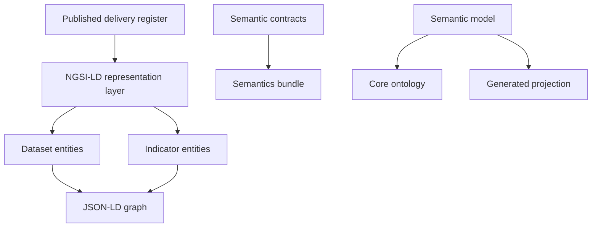

# E3 - Common Data Model and Semantics Pack

**Date:** 2026-06-18
**Version:** V1.0
**Deliverable:** E3 - Modelo NGSI-LD / Common Model

## Purpose

E3 defines the common semantic and technical model used by SustainabilityDataSpace to represent sustainability datasets, indicators, units, policies, relationships, and semantic concepts in an interoperable form. The model supports machine-readable exchange through NGSI-LD, JSON-LD contexts, SHACL constraints, JSON Schema validation, and OWL ontology artifacts. [@ETSI_NGSI_LD_CIM_009] [@W3C_JSON_LD_1_1] [@W3C_SHACL_2017] [@JSON_SCHEMA_2020_12] [@W3C_OWL2_2012]

## Delivery Scope

The E3 model includes:

- NGSI-LD representation for dataset and indicator entities. [@ETSI_NGSI_LD_CIM_009]
- JSON-LD context definitions for SDS and NGSI-LD publication. [@W3C_JSON_LD_1_1]
- SHACL shapes for register and indicator validation. [@W3C_SHACL_2017]
- JSON Schema contract for the register structure. [@JSON_SCHEMA_2020_12]
- OWL semantic model with a stable core TBox and a generated semantic projection. [@W3C_OWL2_2012]
- Deterministic semantics bundle with manifest and file hashes.
- Reproducible validation evidence for representation, semantic packaging, and ontology projection.
- Standards-extension mechanism for ESRS, GRI, and GHG Protocol concepts without changing the common NGSI-LD publication shape. [@GHG_PROTOCOL_CORPORATE_STANDARD] [@GHG_PROTOCOL_SCOPE3_STANDARD]
- Policy and relationship metadata hooks so E3 can support the governance and interoperability boundaries defined in E2 and E6.

The model is designed to support ESRS and GRI-aligned sustainability data and to carry additional standards extensions through the same identifier, context, and semantic-projection mechanism. The validated GHG Protocol exact-equivalence extension uses this extensibility layer without changing the common NGSI-LD model. [@GHG_PROTOCOL_CORPORATE_STANDARD] [@GHG_PROTOCOL_SCOPE3_STANDARD]

## Public Model Sources

E3 is published as a conceptual and machine-readable common model package. Its public source categories are:

| Source category | Public role in E3 |
|---|---|
| SDS and NGSI-LD context layer | Defines the shared JSON-LD vocabulary and NGSI-LD publication shape. |
| Register and indicator validation layer | Defines the constraints for validating dataset and indicator records. |
| Register contract layer | Defines the structured contract for accepted register fields and metadata. |
| Policy contract layer | Defines the policy metadata carried by published dataset entities. |
| Relationship metadata layer | Carries reviewed mapping and interoperability hooks without forcing equivalence claims. |
| Unit and calculation metadata layer | Carries unit, formula, component, and readiness metadata required by E1/E2 technical evidence. |
| Core ontology layer | Defines stable classes and relationships for the sustainability model. |
| Generated projection layer | Projects accepted semantic concepts into the ontology model for runtime and exchange use. |

## Model View

```mermaid
classDiagram
direction LR

class Dataset {
  +dct:identifier
  +dct:title
  +dct:description
  +dct:creator
  +dct:accessRights
  +dct:conformsTo
  +dct:spatial
  +sds:dimension
  +sds:codeESRS
  +sds:codeGRI
  +sds:evidencePath
  +sds:sourceRow
  +odrl:purpose
}

class Indicator {
  +dct:title
}

class Policy

Dataset "1..*" --> "1" Indicator : sds:hasIndicator
Dataset "1" --> "2" Policy : odrl:hasPolicy
```

The published JSON-LD context (`semantics/context/sds/v1.0.jsonld`) defines 61 terms. Beyond `Dataset` and `Indicator`, it models the `RelationshipAssertion`, `UnitConversionRule`, `CalculationContract`, and `Variable` classes that back the relationship, unit, and calculation metadata layers, together with the `sds:codeESRS`, `sds:codeGRI`, and `sds:codeGHG` codes used by the standards-extension mechanism.



## Generated Evidence

| Evidence | Verified result | Public traceability |
|---|---:|---|
| Public E1 dataset-register rows represented as NGSI-LD datasets | 1,805 / 1,805 | `deliverables/E03-modelo-ngsi-ld/evidence/e03-dataset-register-v1-0.csv` |
| NGSI-LD entities written | 3,405 | E03 public model evidence and the E03 row in `deliverables/deliverables-register.csv` |
| Semantics bundle files | 8 | E03 public model evidence and the E03 row in `deliverables/deliverables-register.csv` |
| Semantics bundle manifest | 8 file hashes | E03 public model evidence and the E03 row in `deliverables/deliverables-register.csv` |
| OWL core triples | 189 | E03 public model evidence and the E03 row in `deliverables/deliverables-register.csv` |
| OWL generated projection triples | 38,917 | E03 public model evidence and the E03 row in `deliverables/deliverables-register.csv` |
| Projected semantic concepts | 6,873 | E03 public model evidence and the E03 row in `deliverables/deliverables-register.csv` |
| Representation validation | Pass | E03 public model evidence and the E03 row in `deliverables/deliverables-register.csv` |
| Representation gap list | No open representation gap | E03 public model evidence and the E03 row in `deliverables/deliverables-register.csv` |

The `1,805 / 1,805` denominator is the public E1 dataset-register representation denominator used for E3 validation. It is not the 13-row deliverables register or the official-standard denominator used by E1. It measures serialization coverage, not semantic precision; semantic precision is evidenced separately by the balanced R7 pilot (`100 / 100`, `100%`).

## Semantic Model Capabilities

E3 provides the common model capabilities required by the SDS technical baseline:

| Capability | E3 role |
|---|---|
| Deterministic semantics bundle with manifest hashes | Makes the model package reproducible and reviewable. |
| Dual validation layer with SHACL and JSON Schema | Separates graph-shape validation from structured contract validation. |
| Split ontology model with core TBox and generated projection | Keeps stable model semantics separate from generated concept projection. |
| Runtime projection coverage gate | Verifies that projected concepts are covered by the loaded semantic model. |
| Standards-extension mechanism for GHG Protocol | Demonstrates that the common model can carry additional sustainability standards without changing the NGSI-LD structure. |
| Relationship metadata support | Allows E2 reviewed relationships to be represented without converting partial, transform, or no-match records into false equivalences. |
| Policy metadata support | Allows E6 governance and usage-control evidence to be attached to data products. |
| Unit and calculation metadata support | Allows E1/E2 technical evidence to carry unit, formula, component, and readiness semantics. |

These capabilities do not redefine the official ESRS, GRI, or GHG Protocol reporting obligations. They define the SDS model layer for representing, validating, exchanging, and governing those standards-aligned data products.

## Validation Status

The E3 validation set confirms that the NGSI-LD graph can be generated, the semantics bundle is deterministic, JSON-LD, SHACL, and JSON Schema contracts remain valid, and the runtime ontology loads the split ontology pair with coverage for the semantic concepts stored in the model. [@W3C_JSON_LD_1_1] [@W3C_SHACL_2017] [@JSON_SCHEMA_2020_12] [@W3C_OWL2_2012]

The ontology projection evidence is:

| Projection layer | Result |
|---|---:|
| Core ontology triples | 189 |
| Generated projection triples | 38,917 |
| Runtime merged ontology triples | 39,106 |
| Database-backed semantic concepts covered | 6,873 |
| Projected disclosures | 1,317 |
| Projected variable concepts | 1 |
| Other non-disclosure projected concepts | 5,556 |
| Projected formulas | 2 |

## Compliance Conclusion

E3 is delivered as a reproducible common model package. The delivered artifacts provide the technical model, semantic contracts, NGSI-LD exchange output, ontology projection, validation evidence, and gap evidence required to demonstrate interoperability readiness for the SustainabilityDataSpace model layer.

## References

- European Telecommunications Standards Institute. ETSI GS CIM 009, Context Information Management (CIM); NGSI-LD API. https://cim.etsi.org/NGSI-LD/official/front-page.html. [@ETSI_NGSI_LD_CIM_009]
- Sporny, Manu, Dave Longley, Gregg Kellogg, Markus Lanthaler, Pierre-Antoine Champin, and Niklas Lindstrom. JSON-LD 1.1. W3C Recommendation, July 16, 2020. https://www.w3.org/TR/json-ld11/. [@W3C_JSON_LD_1_1]
- Knublauch, Holger, and Dimitris Kontokostas. Shapes Constraint Language (SHACL). W3C Recommendation, July 20, 2017. https://www.w3.org/TR/shacl/. [@W3C_SHACL_2017]
- JSON Schema. JSON Schema Draft 2020-12. https://json-schema.org/draft/2020-12. [@JSON_SCHEMA_2020_12]
- W3C OWL Working Group. OWL 2 Web Ontology Language Document Overview, second edition. W3C Recommendation, December 11, 2012. https://www.w3.org/TR/owl2-overview/. [@W3C_OWL2_2012]
- Greenhouse Gas Protocol. The Greenhouse Gas Protocol: A Corporate Accounting and Reporting Standard, revised edition. World Resources Institute and World Business Council for Sustainable Development. https://ghgprotocol.org/corporate-standard. [@GHG_PROTOCOL_CORPORATE_STANDARD]
- Greenhouse Gas Protocol. Corporate Value Chain (Scope 3) Accounting and Reporting Standard. World Resources Institute and World Business Council for Sustainable Development, 2011. https://ghgprotocol.org/corporate-value-chain-scope-3-standard. [@GHG_PROTOCOL_SCOPE3_STANDARD]
