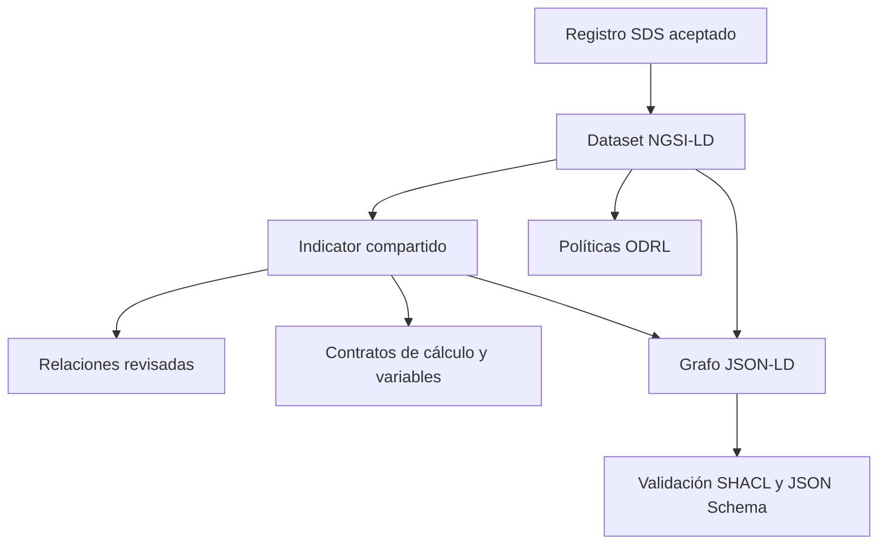

# E3 - Modelo común NGSI-LD y paquete semántico

Tabla 1  Ficha del entregable E3

| Campo | Valor |
|---|---|
| Proyecto | Sustainability Data Spaces (SDS) |
| Entregable | E3 - Modelo común NGSI-LD y paquete semántico |
| Paquete de trabajo | PT2 - Modelado de Datos e Interoperabilidad Técnica |
| Actividad principal | A2.1 - Desarrollo de taxonomías y ontologías para datos de sostenibilidad |
| Versión | V1.0 |
| Fecha | 2026-06-18 |
| Estado | Documento final |
| Responsable | Oficina del Programa SDS |
## Resumen

E3 define el modelo semántico y técnico común que SustainabilityDataSpace utiliza para representar conjuntos de datos de sostenibilidad, indicadores, unidades, políticas, relaciones y conceptos semánticos de forma interoperable. El modelo permite el intercambio legible por máquina mediante NGSI-LD, contextos JSON-LD, restricciones SHACL, validación con JSON Schema y artefactos ontológicos OWL. [@ETSI_NGSI_LD_CIM_009] [@W3C_JSON_LD_1_1] [@W3C_SHACL_2017] [@JSON_SCHEMA_2020_12] [@W3C_OWL2_2012]

## Alcance de entrega

El modelo E3 incluye:

- Representación NGSI-LD de entidades de conjunto de datos e indicador. [@ETSI_NGSI_LD_CIM_009]
- Definiciones de contexto JSON-LD para publicación SDS y NGSI-LD. [@W3C_JSON_LD_1_1]
- Formas SHACL para validar registros e indicadores. [@W3C_SHACL_2017]
- Contrato JSON Schema para la estructura del registro. [@JSON_SCHEMA_2020_12]
- Modelo semántico OWL con una TBox central estable y una proyección semántica generada. [@W3C_OWL2_2012]
- Paquete semántico determinista con manifiesto y resúmenes resumen hash de archivos.
- Evidencia de validación reproducible para representación, empaquetado semántico y proyección ontológica.
- Mecanismo de extensión de normas para conceptos NEIS (ESRS en inglés), Estándares GRI y Protocolo de GEI (GHG Protocol) sin cambiar la forma común de publicación NGSI-LD. [@GHG_PROTOCOL_CORPORATE_STANDARD] [@GHG_PROTOCOL_SCOPE3_STANDARD]
- Ganchos de metadatos de políticas y relaciones para que E3 pueda soportar los límites de gobernanza e interoperabilidad definidos en E2 y E6.

El modelo está diseñado para soportar datos de sostenibilidad alineados con NEIS y Estándares GRI, y para transportar extensiones adicionales de normas mediante el mismo mecanismo de identificador, contexto y proyección semántica. La extensión validada de equivalencia exacta con el Protocolo de GEI utiliza esta capa de extensibilidad sin cambiar el modelo común NGSI-LD. [@GHG_PROTOCOL_CORPORATE_STANDARD] [@GHG_PROTOCOL_SCOPE3_STANDARD]

## Fuentes públicas del modelo

E3 se pública como un paquete conceptual y legible por máquina de modelo común. Sus categorías de fuente pública son:

| Categoría de fuente | Rol público en E3 |
|---|---|
| Capa de contexto SDS y NGSI-LD | Define el vocabulario JSON-LD compartido y la forma de publicación NGSI-LD. |
| Capa de validación de registros e indicadores | Define las restricciones para validar registros de conjuntos de datos e indicadores. |
| Capa de contrato del registro | Define el contrato estructurado para los campos y metadatos aceptados del registro. |
| Capa de contrato de políticas | Define los metadatos de políticas transportados por las entidades de conjunto de datos publicadas. |
| Capa de metadatos de relaciones | Transporta ganchos revisados de mapeo e interoperabilidad sin forzar declaraciones de equivalencia. |
| Capa de metadatos de unidades y cálculo | Transporta metadatos de unidades, fórmulas, componentes y preparación requeridos por la evidencia técnica E1/E2. |
| Capa de ontología central | Define clases y relaciones estables para el modelo de sostenibilidad. |
| Capa de proyección generada | Proyecta los conceptos semánticos aceptados hacia el modelo ontológico para uso en el entorno de ejecución e intercambio. |

## Vista del modelo

| Elemento del modelo | Propiedades / relación |
|---|---|
| `Dataset` (propiedades) | `dct:identifier`; `dct:title`; `dct:description`; `dct:creator`; `dct:accessRights`; `dct:conformsTo`; `dct:spatial`; `sds:dimension`; `sds:codeESRS`; `sds:codeGRI`; `sds:evidencePath`; `sds:sourceRow`; `odrl:purpose` |
| `Indicator` (propiedades) | `dct:title` |
| `Dataset` -> `Indicator` | `sds:hasIndicator`: cada `Dataset` referencia exactamente un `Indicator`; un `Indicator` puede ser compartido por varios `Dataset` (1.805 datasets -> 1.600 indicadores únicos). |
| `Dataset` -> políticas | `odrl:hasPolicy`: cada `Dataset` porta dos políticas (`policy-geofence-eu` y `policy-reporting-365d-retention`). |

El contexto JSON-LD publicado (`semantics/context/sds/v1.0.jsonld`) define 61 términos. Además de `Dataset` e `Indicator`, modela las clases `RelationshipAssertion`, `UnitConversionRule`, `CalculationContract` y `Variable`, que respaldan las capas de metadatos de relaciones, unidades y cálculo descritas arriba, junto con los códigos `sds:codeESRS`, `sds:codeGRI` y `sds:codeGHG` para la extensión de normas.

## Diagrama y jerarquía del modelo

```mermaid
classDiagram
direction LR
class Dataset {
  +dct:identifier
  +dct:title
  +dct:description
  +dct:conformsTo
  +sds:dimension
  +sds:codeESRS
  +sds:codeGRI
}
class Indicator {
  +dct:title
}
class Policy
class RelationshipAssertion
class CalculationContract
class Variable
Dataset "1..*" --> "1" Indicator : sds:hasIndicator
Dataset "1" --> "2" Policy : odrl:hasPolicy
RelationshipAssertion --> Indicator : source/target
CalculationContract --> Variable : components
```

La jerarquía de publicación separa cuatro niveles: registro aceptado, entidades `Dataset`, conceptos `Indicator` compartidos y metadatos de política/relación/cálculo. No se deduce una taxonomía sectorial nueva de esta estructura; los códigos de norma y las relaciones revisadas conservan su procedencia.



## Matriz contractual R5-R7

| Punto contractual | Estado | Evidencia y límite |
|---|---|---|
| Cobertura y organización R5 | Demostrado | El gate R5 verifica `1.805 / 1.805` variables representadas y `1.805 / 1.805` con relaciones válidas `Dataset → Indicator` y `Dataset → Policy`, además de dimensión estructurada. Cobertura y jerarquía: `100%`, frente al mínimo `80%`. |
| Documentación y compatibilidad R6 | Demostrado | Vista de clases, diagramas, contexto JSON-LD, SHACL, JSON Schema y extensiones de códigos NEIS/ESRS y GRI. |
| Piloto funcional R7 | Demostrado | Un subconjunto determinista de 100 variables —50 ESRS y 50 GRI— compara título, descripción, dimensión, códigos de estándar, propietario, acceso, relación a indicador y título del indicador. Resultado: `100 / 100`, precisión `100%`, frente al mínimo `90%`. |

| Fuente / paso | Produce / alimenta |
|---|---|
| Registro de entregables publicado | Capa de representación NGSI-LD |
| Capa de representación NGSI-LD | Entidades Dataset |
| Capa de representación NGSI-LD | Entidades Indicator |
| Entidades Dataset | Grafo JSON-LD |
| Entidades Indicator | Grafo JSON-LD |
| Contratos semánticos | Paquete semántico |
| Modelo semántico | Ontología central |
| Modelo semántico | Proyección generada |

## Evidencia generada

| Evidencia | Resultado verificado | Trazabilidad pública |
|---|---:|---|
| Filas del registro público de conjuntos de datos E1 representadas como conjuntos de datos NGSI-LD | 1,805 / 1,805 | `deliverables/E03-modelo-ngsi-ld/evidence/e03-dataset-register-v1-0.csv` y evidencia pública del modelo E03 |
| Entidades NGSI-LD escritas | 3,405 | Evidencia pública del modelo E03 y fila E03 en `deliverables/deliverables-register.csv` |
| Archivos del paquete semántico | 8 | Evidencia pública del modelo E03 y fila E03 en `deliverables/deliverables-register.csv` |
| Manifiesto del paquete semántico | 8 resúmenes resumen hash de archivos | Evidencia pública del modelo E03 y fila E03 en `deliverables/deliverables-register.csv` |
| Tripletas OWL centrales | 189 | Evidencia pública del modelo E03 y fila E03 en `deliverables/deliverables-register.csv` |
| Tripletas OWL de proyección generada | 38,917 | Evidencia pública del modelo E03 y fila E03 en `deliverables/deliverables-register.csv` |
| Conceptos semánticos proyectados | 6,873 | Evidencia pública del modelo E03 y fila E03 en `deliverables/deliverables-register.csv` |
| Validación de representación | Superada | Evidencia pública del modelo E03 y fila E03 en `deliverables/deliverables-register.csv` |
| Lista de brechas de representación | Sin brechas abiertas de representación | Evidencia pública del modelo E03 y fila E03 en `deliverables/deliverables-register.csv` |

El denominador `1,805 / 1,805` procede del registro público de conjuntos de datos E1 conservado en la evidencia E3. No es el registro de 13 entregables ni el denominador de normas oficiales utilizado por E1. La cifra es cobertura de serialización NGSI-LD y no mide por sí sola la precisión semántica. R7 se demuestra separadamente mediante el piloto de 100 filas con resultados esperados y observados.

Evidencia específica R5/R7:

- `deliverables/E03-modelo-ngsi-ld/evidence/e3-r5-hierarchy-matrix-v1-0.csv` — 1.805 variables, relaciones y estado por fila.
- `deliverables/E03-modelo-ngsi-ld/evidence/e3-r5-hierarchy-report-v1-0.json` — cobertura y jerarquía `100%`, `passed=true`.
- `deliverables/E03-modelo-ngsi-ld/evidence/e3-r7-functional-pilot-matrix-v1-0.csv` — esperado/observado para 100 variables equilibradas ESRS/GRI.
- `deliverables/E03-modelo-ngsi-ld/evidence/e3-r7-functional-pilot-report-v1-0.json` — `100 / 100`, precisión `100%`, `passed=true`.

## Capacidades del modelo semántico

E3 proporciona las capacidades del modelo común requeridas por la línea base técnica de SDS:

| Capacidad | Rol de E3 |
|---|---|
| Paquete semántico determinista con resúmenes resumen hash de manifiesto | Hace que el paquete del modelo sea reproducible y revisable. |
| Capa doble de validación con SHACL y JSON Schema | Separa la validación de forma de grafo de la validación de contrato estructurado. |
| Modelo ontológico dividido con TBox central y proyección generada | Mantiene separada la semántica estable del modelo respecto de la proyección generada de conceptos. |
| Control de validación de cobertura de proyección en el entorno de ejecución | Verifica que los conceptos proyectados estén cubiertos por el modelo semántico cargado. |
| Mecanismo de extensión de normas para el Protocolo de GEI | Demuestra que el modelo común puede transportar normas de sostenibilidad adicionales sin cambiar la estructura NGSI-LD. |
| Soporte de metadatos de relaciones | Permite representar las relaciones revisadas de E2 sin convertir registros parciales, de transformación o sin correspondencia en equivalencias falsas. |
| Soporte de metadatos de políticas | Permite adjuntar evidencia de gobernanza y control de uso de E6 a productos de datos. |
| Soporte de metadatos de unidades y cálculo | Permite que la evidencia técnica E1/E2 transporte semántica de unidades, fórmulas, componentes y preparación. |

Estas capacidades no redefinen las obligaciones oficiales de reporte de NEIS, Estándares GRI ni Protocolo de GEI. Definen la capa de modelo SDS para representar, validar, intercambiar y gobernar esos productos de datos alineados con normas.

## Estado de validación

El conjunto de validación de E3 confirma que el grafo NGSI-LD puede generarse, que el paquete semántico es determinista, que los contratos JSON-LD, SHACL y JSON Schema siguen siendo válidos, y que la ontología en el entorno de ejecución carga el par de ontologías dividido con cobertura para los conceptos semánticos almacenados en el modelo. [@W3C_JSON_LD_1_1] [@W3C_SHACL_2017] [@JSON_SCHEMA_2020_12] [@W3C_OWL2_2012]

La evidencia de proyección ontológica es:

| Capa de proyección | Resultado |
|---|---:|
| Tripletas de la ontología central | 189 |
| Tripletas de la proyección generada | 38,917 |
| Tripletas de la ontología fusionada en el entorno de ejecución | 39,106 |
| Conceptos semánticos respaldados por base de datos cubiertos | 6,873 |
| Divulgaciones proyectadas | 1,317 |
| Conceptos de variables proyectados | 1 |
| Otros conceptos proyectados que no son divulgaciones | 5,556 |
| Fórmulas proyectadas | 2 |

## Conclusión de cumplimiento

E3 se entrega como un paquete reproducible de modelo común. Los artefactos proporcionan el modelo técnico, los contratos semánticos, la salida NGSI-LD, la proyección ontológica y evidencia por fila. R5 queda cerrado con cobertura y jerarquía válidas para `1.805 / 1.805` variables; R7 queda cerrado con un piloto determinista de 100 variables y precisión del `100%`.

## Referencias

- European Telecommunications Standards Institute. ETSI GS CIM 009, Context Information Management (CIM); NGSI-LD API. https://cim.etsi.org/NGSI-LD/official/front-page.html. [@ETSI_NGSI_LD_CIM_009]
- Sporny, Manu, Dave Longley, Gregg Kellogg, Markus Lanthaler, Pierre-Antoine Champin, and Niklas Lindstrom. JSON-LD 1.1. W3C Recommendation, July 16, 2020. https://www.w3.org/TR/json-ld11/. [@W3C_JSON_LD_1_1]
- Knublauch, Holger, and Dimitris Kontokostas. Shapes Constraint Language (SHACL). W3C Recommendation, July 20, 2017. https://www.w3.org/TR/shacl/. [@W3C_SHACL_2017]
- JSON Schema. JSON Schema Draft 2020-12. https://json-schema.org/draft/2020-12. [@JSON_SCHEMA_2020_12]
- W3C OWL Working Group. OWL 2 Web Ontology Language Document Overview, second edition. W3C Recommendation, December 11, 2012. https://www.w3.org/TR/owl2-overview/. [@W3C_OWL2_2012]
- Greenhouse Gas Protocol. The Greenhouse Gas Protocol: A Corporate Accounting and Reporting Standard, revised edition. World Resources Institute and World Business Council for Sustainable Development. https://ghgprotocol.org/corporate-standard. [@GHG_PROTOCOL_CORPORATE_STANDARD]
- Greenhouse Gas Protocol. Corporate Value Chain (Scope 3) Accounting and Reporting Standard. World Resources Institute and World Business Council for Sustainable Development, 2011. https://ghgprotocol.org/corporate-value-chain-scope-3-standard. [@GHG_PROTOCOL_SCOPE3_STANDARD]
