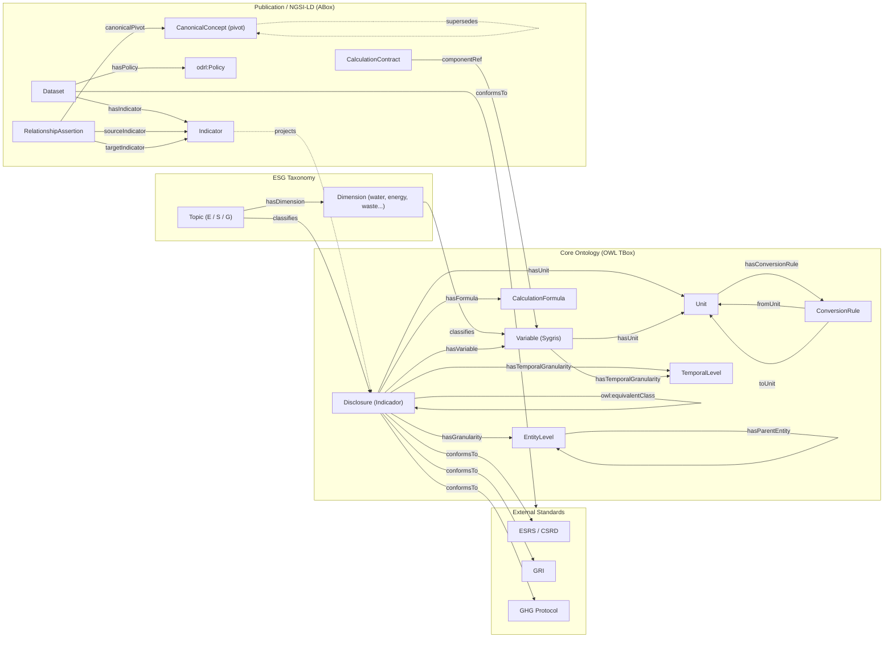

# SDS Ontology — Semantic Connections

This diagram captures the semantic model of the Sustainability Data Space across its
coordinated layers: the ESG taxonomy, the OWL core ontology (TBox), the external
standards it conforms to, and the NGSI-LD publication/ABox layer.

All classes share the namespace `sds: https://sustainabilitydataspace.com/ontology#`.

Source definitions:
- OWL core: `api/ontologies/base.owl`, `api/ontologies/core_tbox.owl`
- JSON-LD context: `semantics/context/sds/v1.0.jsonld`
- SHACL shapes: `semantics/shacl/`
- Relational backbone: `api/src/database/models.py`
- Projection bridge (DB -> OWL): `api/src/ontology/projection_generator.py`

## Semantic connections (edge list)

| Source | Relationship | Target |
|---|---|---|
| Topic | hasDimension | Dimension |
| Topic | classifies | Disclosure |
| Dimension | classifies | Variable |
| Disclosure | conformsTo | ESRS / GRI / GHG |
| Disclosure | hasVariable | Variable |
| Disclosure | hasUnit | Unit |
| Disclosure | hasFormula | CalculationFormula |
| Disclosure | hasGranularity | EntityLevel |
| Disclosure | hasTemporalGranularity | TemporalLevel |
| Disclosure | owl:equivalentClass | Disclosure (cross-standard) |
| Variable | hasUnit | Unit |
| Variable | hasTemporalGranularity | TemporalLevel |
| EntityLevel | hasParentEntity | EntityLevel (self, hierarchy) |
| Unit | hasConversionRule | ConversionRule |
| ConversionRule | fromUnit / toUnit | Unit |
| Dataset | hasIndicator | Indicator |
| Dataset | hasPolicy | odrl:Policy |
| Dataset | conformsTo | Standard |
| Indicator | projects (ABox of) | Disclosure |
| RelationshipAssertion | sourceIndicator / targetIndicator | Indicator |
| RelationshipAssertion | canonicalPivot | CanonicalConcept |
| CalculationContract | componentRef | Variable |
| CanonicalConcept | supersedes | CanonicalConcept (versioning) |

## ORM Relational Data Model (ERD)

The operational backbone — SQLAlchemy models in `api/src/database/models.py`, with
foreign-key relationships. The semantic ontology above is projected from these tables
via `api/src/ontology/projection_generator.py`.

```mermaid
erDiagram
  UserAccount ||--o{ APIKeyRecord : "user_id"
  UnitCategory ||--o{ Unit : "category_id"
  FXRateBatch ||--o{ FXRateObservation : "batch_id"

  Indicator ||--o{ Concept : "indicator_id"
  Concept ||--o{ ConceptFormula : "concept_id"
  Concept ||--o{ ConceptVariable : "concept_id"
  Concept ||--o{ ConceptEquivalence : "source_concept_id"
  Concept ||--o{ ConceptIndicatorLink : "concept_id"
  Indicator ||--o{ ConceptIndicatorLink : "indicator_id"

  CanonicalConcept ||--o{ CanonicalConcept : "superseded_by"
  Indicator ||--o{ CanonicalConcept : "indicator_id"
  CanonicalConcept ||--o{ CanonicalConceptFormula : "concept_id"
  CanonicalConcept ||--o{ CanonicalConceptVariable : "concept_id"
  CanonicalConcept ||--o{ CanonicalConceptEquivalence : "concept_id"
  CanonicalConcept ||--o{ CanonicalConceptIndicatorLink : "concept_id"
  Indicator ||--o{ CanonicalConceptIndicatorLink : "indicator_id"

  StandardRelease ||--o{ StandardDatapoint : "standard_release_id"
  StandardDatapoint ||--o{ MappingAssertionGroup : "source_datapoint_id"
  DatasetSnapshot ||--o{ MappingAssertionGroup : "package_snapshot_id"
  MappingAssertionGroup ||--o{ MappingAssertionGroup : "superseded_by"
  MappingAssertionGroup ||--o{ MappingAssertionComponent : "assertion_group_id"
  CanonicalConcept ||--o{ MappingAssertionComponent : "canonical_concept_id"

  StandardDatapoint ||--o{ MaterializedPairwiseMapping : "source_target_datapoint"
  MappingAssertionGroup ||--o{ MaterializedPairwiseMapping : "source_target_group"
  DatasetSnapshot ||--o{ MaterializedPairwiseMapping : "generated_snapshot_id"

  AtomizerPackageImport ||--o{ CanonicalCalculationContract : "package_import_id"
  Indicator ||--o{ CanonicalCalculationContract : "indicator_id"
  CanonicalCalculationContract ||--o{ CanonicalCalculationComponent : "contract_id"
  AtomizerPackageImport ||--o{ CanonicalCalculationComponent : "package_import_id"
  FXPolicy ||--o{ CanonicalCalculationComponent : "fx_policy_id"
  CanonicalCalculationContract ||--o{ CanonicalCalculationDimension : "contract_id"
  CanonicalCalculationContract ||--o{ CanonicalCalculationGate : "contract_id"
  CanonicalCalculationContract ||--o{ CanonicalCalculationSupportRule : "contract_id"

  Indicator ||--o{ ValueContext : "sds_indicator_id"
  ValueContext ||--o{ ValueRevision : "context_id"
  CanonicalCalculationContract ||--o{ ValueRevision : "calculation_contract_id"
  ValueRevision ||--o{ ValueRevision : "parent_revision_id"
  ValueContext ||--o{ ValueRevisionEvent : "context_id"
  ValueRevision ||--o{ ValueRevisionEvent : "revision_id"
  ValueContext ||--|| CurrentValuePointer : "context_id"
  ValueRevision ||--o{ CurrentValuePointer : "revision_id"
  ValueContext ||--o{ ReportedValuePointer : "context_id"
  ValueRevision ||--o{ ReportedValuePointer : "revision_id"
```

Standalone tables with no FK edges (configuration / registry / job / i18n):
`HierarchyConfiguration`, `ESGValue`, `ValueIdempotencyKey`, `ValueImportJob`,
`IndicatorImportJob`, `CanonicalMappingPackageJob`, `SustainabilityStandard`,
`StandardMapping`, `MetricType`, `Currency`, `FXRatePeriod`, `ConversionRule`,
`RevokedToken`, `LocalizedText`.
